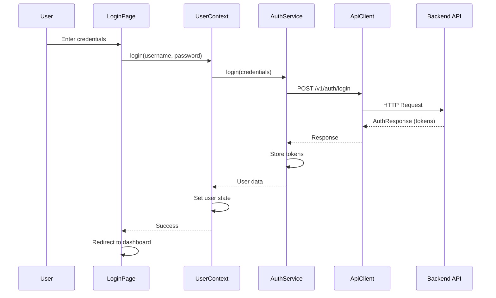
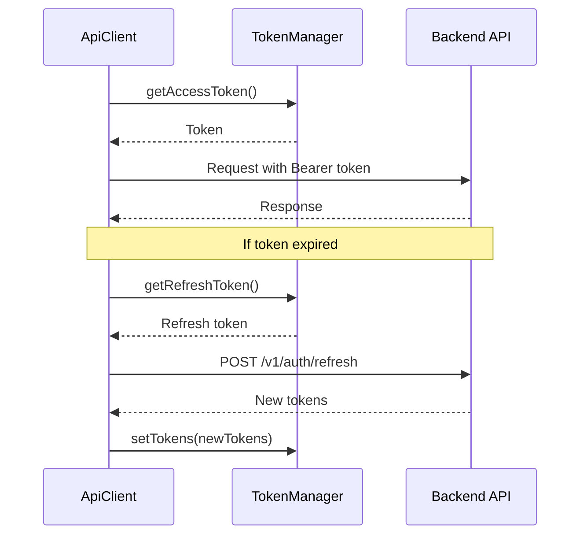

# OBUS Partner Dashboard - Login Implementation Documentation

## Table of Contents
1. [Overview](#overview)
2. [Architecture](#architecture)
3. [Authentication Flow](#authentication-flow)
4. [File Structure](#file-structure)
5. [Implementation Details](#implementation-details)
6. [API Integration](#api-integration)
7. [Security Features](#security-features)
8. [UI/UX Components](#uiux-components)
9. [State Management](#state-management)
10. [Error Handling](#error-handling)
11. [Best Practices](#best-practices)
12. [Replication Guide](#replication-guide)

## Overview

The OBUS Partner Dashboard implements a comprehensive authentication system with role-based access control, token management, and a modern UI/UX design. The system supports two main user types: **Administrator** and **Partner User**, with dynamic navigation filtering and secure API integration.

### Key Features
- ✅ **JWT Token Authentication** with refresh token support
- ✅ **Role-Based Access Control** (Admin/Partner)
- ✅ **Secure Token Management** with localStorage persistence
- ✅ **Modern UI/UX** with responsive design
- ✅ **API Client** with automatic token injection
- ✅ **Error Handling** with user-friendly messages
- ✅ **Loading States** and form validation
- ✅ **Password Visibility Toggle**
- ✅ **Auto-redirect** for authenticated users

## Architecture

### High-Level Architecture
```
┌─────────────────┐    ┌─────────────────┐    ┌─────────────────┐
│   Login Page    │───▶│  Auth Service   │───▶│   API Client    │
│   (UI Layer)    │    │ (Business Logic)│    │ (HTTP Layer)    │
└─────────────────┘    └─────────────────┘    └─────────────────┘
         │                       │                       │
         ▼                       ▼                       ▼
┌─────────────────┐    ┌─────────────────┐    ┌─────────────────┐
│  User Context   │    │ Token Manager   │    │  API Endpoints  │
│ (State Mgmt)    │    │ (Token Storage) │    │ (Backend API)   │
└─────────────────┘    └─────────────────┘    └─────────────────┘
```

### Component Hierarchy
```
RootLayout
├── UserProvider (Context)
│   ├── LoginPage
│   │   ├── LoginForm
│   │   ├── PasswordInput
│   │   └── ErrorDisplay
│   └── DashboardLayout (Protected)
│       ├── AuthGuard
│       ├── Sidebar (Role-filtered)
│       └── TopBar (User info)
```

## Authentication Flow

### 1. Login Process


### 2. Token Management


## File Structure

### Core Authentication Files
```
lib/
├── api/
│   ├── client.ts              # HTTP client with token management
│   ├── config.ts              # API configuration and endpoints
│   ├── types.ts               # TypeScript interfaces
│   └── services/
│       ├── auth.ts            # Authentication service
│       └── index.ts           # Service exports
├── contexts/
│   └── UserContext.tsx        # User state management
└── utils.ts                   # Utility functions

components/
├── AuthGuard.tsx              # Route protection component
├── DashboardLayout.tsx        # Protected layout wrapper
├── Sidebar.tsx                # Role-based navigation
├── TopBar.tsx                 # User profile and logout
└── ui/                        # Reusable UI components

app/
├── (root)/
│   ├── (auth)/
│   │   └── login/
│   │       ├── page.tsx       # Main login page
│   │       └── 1ogin.tsx      # Alternative login design
│   └── layout.tsx             # Root layout with UserProvider
└── layout.tsx                 # App root layout
```

## Implementation Details

### 1. Login Page (`app/(root)/(auth)/login/page.tsx`)

**Key Features:**
- Form validation with real-time error clearing
- Password visibility toggle
- Loading states with spinner
- Auto-redirect for authenticated users
- Professional OBUS branding

**Form State Management:**
```typescript
const [formData, setFormData] = useState({
  username: "",
  password: "",
});
const [formError, setFormError] = useState("");
const [showPassword, setShowPassword] = useState(false);
```

**Form Submission:**
```typescript
const handleSubmit = async (e: React.FormEvent) => {
  e.preventDefault();
  setFormError("");

  // Basic validation
  if (!formData.username || !formData.password) {
    setFormError("Please enter both username and password");
    return;
  }

  try {
    await login(formData.username, formData.password);
    router.push("/");
  } catch (err) {
    setFormError(authError || "Login failed. Please check your credentials.");
  }
};
```

### 2. User Context (`lib/contexts/UserContext.tsx`)

**State Management:**
```typescript
interface UserContextType {
  user: User | null;
  isLoading: boolean;
  isAuthenticated: boolean;
  error: string | null;
  setUser: (user: User | null) => void;
  login: (username: string, password: string) => Promise<void>;
  logout: () => Promise<void>;
  hasRole: (role: UserRole) => boolean;
  hasAnyRole: (roles: UserRole[]) => boolean;
  hasPermission: (permission: string) => boolean;
  hasAnyPermission: (permissions: string[]) => boolean;
}
```

**User Data Transformation:**
```typescript
const userData: User = {
  id: authResponse.partnerId || authResponse.agentId || 1,
  uid: authResponse.partnerUid || "unknown",
  displayName: authResponse.displayName || username,
  username: authResponse.username,
  email: authResponse.email,
  userType: (authResponse.userType.toLowerCase() as UserRole) || "admin",
  partner: authResponse.partnerBusinessName ? {
    id: authResponse.partnerId,
    uid: authResponse.partnerUid,
    name: authResponse.partnerBusinessName,
    code: authResponse.partnerCode,
    businessName: authResponse.partnerBusinessName,
  } : undefined,
  status: "active",
  roles: authResponse.roles || [],
  permissions: authResponse.permissions || [],
  // ... additional fields
};
```

### 3. Authentication Service (`lib/api/services/auth.ts`)

**Login Method:**
```typescript
async login(credentials: LoginRequest): Promise<AuthResponse> {
  const response = await apiClient.post<AuthResponse>(
    API_ENDPOINTS.AUTH.LOGIN,
    credentials
  );

  if (response.status && response.data) {
    // Store tokens in the token manager
    const { accessToken, refreshToken } = response.data;
    if (accessToken && refreshToken) {
      const { tokenManager } = await import("../client");
      tokenManager.setTokens(accessToken, refreshToken);
    }
    return response.data;
  }

  throw new Error(response.message || "Login failed");
}
```

### 4. API Client (`lib/api/client.ts`)

**Token Management:**
```typescript
class TokenManager {
  private accessToken: string | null = null;
  private refreshToken: string | null = null;

  setTokens(accessToken: string, refreshToken: string) {
    this.accessToken = accessToken;
    this.refreshToken = refreshToken;
    localStorage.setItem("accessToken", accessToken);
    localStorage.setItem("refreshToken", refreshToken);
  }

  getAccessToken(): string | null {
    if (!this.accessToken) {
      this.accessToken = localStorage.getItem("accessToken");
    }
    return this.accessToken;
  }

  clearTokens() {
    this.accessToken = null;
    this.refreshToken = null;
    localStorage.removeItem("accessToken");
    localStorage.removeItem("refreshToken");
  }

  isAuthenticated(): boolean {
    return !!this.getAccessToken();
  }
}
```

**Automatic Token Injection:**
```typescript
// Add authentication headers
const accessToken = tokenManager.getAccessToken();
const apiKey = apiKeyManager.getApiKey();
const apiSecret = apiKeyManager.getApiSecret();

if (accessToken) {
  headers["Authorization"] = `Bearer ${accessToken}`;
}

if (apiKey) {
  headers["X-API-Key"] = apiKey;
}

if (apiSecret) {
  headers["X-API-Secret"] = apiSecret;
}
```

### 5. AuthGuard Component (`components/AuthGuard.tsx`)

**Route Protection:**
```typescript
export function AuthGuard({
  children,
  requireAuth = true,
  fallbackPath = "/login",
}: AuthGuardProps) {
  const { isAuthenticated, isLoading } = useUser();
  const router = useRouter();

  useEffect(() => {
    if (!isLoading) {
      if (requireAuth && !isAuthenticated) {
        router.push(fallbackPath);
      }
    }
  }, [isAuthenticated, isLoading, requireAuth, fallbackPath, router]);

  // Show loading state while checking authentication
  if (isLoading) {
    return (
      <div className="min-h-screen flex items-center justify-center">
        <div className="text-center">
          <div className="w-8 h-8 border-2 border-obus-primary/30 border-t-obus-primary rounded-full animate-spin mx-auto mb-4"></div>
          <p className="text-obus-text-secondary">Loading...</p>
        </div>
      </div>
    );
  }

  // Don't render children if authentication is required but not authenticated
  if (requireAuth && !isAuthenticated) {
    return null;
  }

  return <>{children}</>;
}
```

## API Integration

### API Configuration (`lib/api/config.ts`)

**Environment-based URL Configuration:**
```typescript
export const getApiBaseUrl = (): string => {
  const isDevelopment = typeof process !== "undefined" && process.env.NODE_ENV === "development";
  const isLocalhost = typeof window !== "undefined" && window.location.hostname === "localhost";

  const baseUrl = isDevelopment || isLocalhost
    ? "http://localhost:3000/api"
    : "https://obus-partners.otapp.live/api";

  return baseUrl;
};
```

**API Endpoints:**
```typescript
export const API_ENDPOINTS = {
  AUTH: {
    LOGIN: "/v1/auth/login",
    REFRESH: "/v1/auth/refresh",
    LOGOUT: "/v1/auth/logout",
    RESET_PASSWORD: "/v1/auth/password/reset",
    CONFIRM_RESET: "/v1/auth/password/confirm-reset",
    CHANGE_PASSWORD: "/v1/auth/password/change",
  },
  // ... other endpoints
} as const;
```

### Type Definitions (`lib/api/types.ts`)

**Authentication Types:**
```typescript
export interface LoginRequest {
  username: string;
  password: string;
}

export interface AuthResponse {
  accessToken: string;
  refreshToken: string;
  type: string;
  username: string;
  email: string;
  userType: string;
  requireResetPassword: boolean;
  partnerId: number;
  partnerUid: string;
  partnerCode: string;
  partnerBusinessName: string;
  displayName: string;
  roles: string[];
  tokenExpiresAt: string;
  agentId: number;
  agentStatus: string;
  lastLoginAt: string;
  permissions: string[];
}
```

## Security Features

### 1. Token Security
- **JWT Tokens**: Access and refresh token implementation
- **Secure Storage**: localStorage with automatic cleanup
- **Token Expiration**: Automatic token refresh handling
- **Logout Cleanup**: Complete token removal on logout

### 2. Input Validation
- **Client-side Validation**: Form field validation
- **Error Handling**: User-friendly error messages
- **XSS Prevention**: Proper input sanitization

### 3. Route Protection
- **AuthGuard**: Automatic route protection
- **Role-based Access**: Navigation filtering by user role
- **Redirect Logic**: Automatic redirects for unauthenticated users

### 4. API Security
- **Bearer Token Authentication**: Automatic token injection
- **API Key Support**: Additional authentication headers
- **Request Timeout**: Configurable timeout settings
- **Retry Logic**: Exponential backoff for failed requests

## UI/UX Components

### 1. Login Form Design

**Visual Elements:**
- **OBUS Branding**: Professional logo and color scheme
- **Gradient Background**: Modern gradient from primary to dark blue
- **Card Layout**: Clean white card with backdrop blur
- **Form Styling**: Consistent input styling with focus states

**Color Scheme:**
```css
/* Primary Colors */
--obus-primary: #374151;
--obus-accent: #FC7F05;
--obus-bg: #F5F7FA;
--obus-text-primary: #212121;
--obus-text-secondary: #757575;
--obus-text-light: #E0E0E0;
```

**Interactive Elements:**
- **Password Toggle**: Eye icon for password visibility
- **Loading States**: Spinner animation during login
- **Error Display**: Red error messages with icons
- **Hover Effects**: Subtle hover animations

### 2. Responsive Design
- **Mobile-first**: Responsive design for all screen sizes
- **Touch-friendly**: Appropriate touch targets
- **Adaptive Layout**: Sidebar collapse on mobile
- **Flexible Typography**: Scalable text sizes

### 3. Accessibility Features
- **Keyboard Navigation**: Full keyboard support
- **Screen Reader Support**: Proper ARIA labels
- **Color Contrast**: WCAG AA compliant colors
- **Focus Indicators**: Clear focus states

## State Management

### 1. User Context Provider
```typescript
export function UserProvider({ children }: { children: React.ReactNode }) {
  const [user, setUser] = useState<User | null>(null);
  const [isLoading, setIsLoading] = useState(true);
  const [error, setError] = useState<string | null>(null);

  // Initialize authentication on app start
  useEffect(() => {
    const initializeAuth = async () => {
      try {
        setIsLoading(true);
        setError(null);
        const isAuthenticated = await authService.isAuthenticated();
        if (isAuthenticated) {
          await checkCurrentUser();
        }
      } catch (err) {
        console.error("Auth initialization error:", err);
        setError("Authentication failed");
      } finally {
        setIsLoading(false);
      }
    };
    initializeAuth();
  }, []);
}
```

### 2. Role-based Navigation
```typescript
// Filter navigation items based on user role
const filteredNavigationItems = navigationItems.filter((item) => {
  if (!item.allowedRoles) return true;
  return hasAnyRole(item.allowedRoles);
});
```

### 3. Permission Checking
```typescript
const hasRole = (role: UserRole): boolean => {
  return user?.userType === role;
};

const hasAnyRole = (roles: UserRole[]): boolean => {
  return user ? roles.includes(user.userType) : false;
};

const hasPermission = (permission: string): boolean => {
  return user?.permissions?.includes(permission) || false;
};
```

## Error Handling

### 1. Form Validation Errors
```typescript
// Basic validation
if (!formData.username || !formData.password) {
  setFormError("Please enter both username and password");
  return;
}
```

### 2. API Error Handling
```typescript
try {
  await login(formData.username, formData.password);
  router.push("/");
} catch (err) {
  setFormError(authError || "Login failed. Please check your credentials.");
}
```

### 3. Network Error Handling
```typescript
// Retry logic for network errors
if (retryCount < this.retries && this.isRetryableError(error)) {
  await this.delay(1000 * Math.pow(2, retryCount)); // Exponential backoff
  return this.makeRequest<T>(endpoint, options, retryCount + 1);
}
```

### 4. User-friendly Error Messages
```typescript
{(formError || authError) && (
  <div className="text-sm text-red-600 bg-red-50 p-3 rounded-lg border border-red-200 flex items-center gap-2">
    <div className="w-2 h-2 bg-red-500 rounded-full"></div>
    <span>{formError || authError}</span>
  </div>
)}
```

## Best Practices

### 1. Code Organization
- **Separation of Concerns**: Clear separation between UI, business logic, and API layers
- **Type Safety**: Comprehensive TypeScript interfaces
- **Modular Architecture**: Reusable components and services
- **Consistent Naming**: Clear, descriptive variable and function names

### 2. Security Best Practices
- **Token Management**: Secure token storage and automatic cleanup
- **Input Validation**: Both client and server-side validation
- **Error Handling**: No sensitive information in error messages
- **HTTPS**: Secure communication with API endpoints

### 3. Performance Optimization
- **Lazy Loading**: Dynamic imports for token manager
- **Memoization**: React.memo for expensive components
- **Debouncing**: Form input debouncing
- **Caching**: Token caching in memory and localStorage

### 4. User Experience
- **Loading States**: Clear loading indicators
- **Error Recovery**: Easy error recovery mechanisms
- **Accessibility**: WCAG compliance
- **Responsive Design**: Mobile-first approach

## Replication Guide

### Step 1: Project Setup
```bash
# Create Next.js project
npx create-next-app@latest obus-partner-dashboard --typescript --tailwind --eslint

# Install additional dependencies
npm install lucide-react @radix-ui/react-dropdown-menu @radix-ui/react-dialog
```

### Step 2: File Structure Setup
Create the following directory structure:
```
lib/
├── api/
│   ├── client.ts
│   ├── config.ts
│   ├── types.ts
│   └── services/
│       ├── auth.ts
│       └── index.ts
├── contexts/
│   └── UserContext.tsx
└── utils.ts

components/
├── AuthGuard.tsx
├── DashboardLayout.tsx
├── Sidebar.tsx
├── TopBar.tsx
└── ui/
    ├── button.tsx
    ├── input.tsx
    ├── card.tsx
    └── ...

app/
├── (root)/
│   ├── (auth)/
│   │   └── login/
│   │       └── page.tsx
│   └── layout.tsx
└── layout.tsx
```

### Step 3: Core Implementation

1. **API Client** (`lib/api/client.ts`)
   - Implement TokenManager class
   - Create ApiClient with automatic token injection
   - Add error handling and retry logic

2. **Authentication Service** (`lib/api/services/auth.ts`)
   - Implement login, logout, and token refresh methods
   - Add password reset functionality
   - Handle token storage

3. **User Context** (`lib/contexts/UserContext.tsx`)
   - Create React context for user state
   - Implement role and permission checking
   - Add authentication initialization

4. **Login Page** (`app/(root)/(auth)/login/page.tsx`)
   - Create responsive login form
   - Add form validation and error handling
   - Implement password visibility toggle

5. **AuthGuard** (`components/AuthGuard.tsx`)
   - Create route protection component
   - Add loading states
   - Implement redirect logic

### Step 4: UI Components

1. **Design System**
   - Set up Tailwind configuration with OBUS colors
   - Create reusable UI components
   - Implement consistent styling

2. **Layout Components**
   - Create responsive sidebar with role filtering
   - Implement top bar with user profile
   - Add mobile navigation support

### Step 5: Integration

1. **API Integration**
   - Configure API endpoints
   - Set up environment-based URLs
   - Test authentication flow

2. **State Management**
   - Integrate UserContext with components
   - Implement role-based navigation
   - Add permission checking

### Step 6: Testing and Validation

1. **Authentication Flow**
   - Test login/logout functionality
   - Verify token management
   - Check route protection

2. **Role-based Access**
   - Test navigation filtering
   - Verify permission checking
   - Validate user context

3. **Error Handling**
   - Test form validation
   - Verify error messages
   - Check network error handling

### Step 7: Production Considerations

1. **Security**
   - Implement HTTPS
   - Add CSRF protection
   - Validate all inputs

2. **Performance**
   - Optimize bundle size
   - Implement code splitting
   - Add caching strategies

3. **Monitoring**
   - Add error tracking
   - Implement analytics
   - Monitor API performance

## Conclusion

This login implementation provides a robust, secure, and user-friendly authentication system for the OBUS Partner Dashboard. The architecture is scalable, maintainable, and follows modern React and Next.js best practices. The system can be easily replicated for other applications by following the step-by-step guide provided above.

The implementation includes comprehensive error handling, role-based access control, and a modern UI/UX design that aligns with the OBUS brand guidelines. All components are fully typed with TypeScript and follow accessibility best practices.

For production deployment, ensure proper server-side validation, implement additional security measures, and consider adding features like two-factor authentication and session management.
